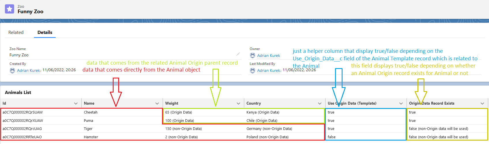

The problem:
 We want to display some records using JavaScript datatable, but in case of some records we have to display in one row data that comes from two different related objects (where the parent is the "main" object).

 In this specific case we are using 4 objects.
  - Zoo - here we want to display JS datatable that contains related Animal records
  - Animal - here we have a Lookup to the Zoo and Animal Template objects
  - Animal Origin - here we have a Lookup to the Animal object

The relation between the Animal and Animal Origin objects is **one to many**, so obviously one Animal can have 0 or many related Animal Origin records. But in this specific case we are assuming that the backend logic of the application always delivers only ONE unique Animal Origin (or 0 if there is no existing related record) record related to the Animal.

We want to achieve something like this:

The problem here is that the "main" object that we are using to fill the datatable is Animal and it is a parent for the Animal Origin object. So we cannot just use the "dot notation" to access fields of the related object (we could do this if the Animal object were a child of the Animal Origin object).

This example presents the way to use the wrapper class that wraps Animal and Animal Origin records that are related to each other.